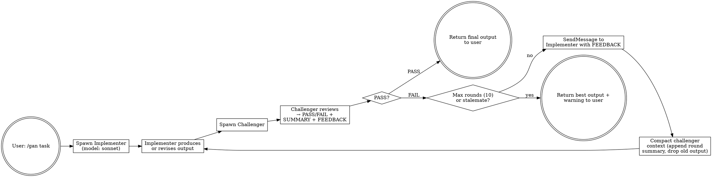

# Adversarial Review (GAN Loop)

## Overview

A persistent adversarial loop between two agents: an **Implementer** (Sonnet) that produces output, and a **Challenger** (Haiku) that critiques it. The loop drives iterative improvement through structured verdicts until the output is excellent.

**Core principle:** The challenger IS the quality gate. Nothing returns to the user until the challenger says PASS.

## When to Use

- User explicitly types `/gan "..."` or `/gan ...`
- Complex, multi-faceted tasks where a second pair of eyes catches real issues
- Tasks where correctness matters: algorithms, parsers, data pipelines, auth logic
- Design + implementation tasks where blind spots are likely

**When NOT to use:**
- Trivial one-liners or single-function tasks with no room for error
- Tasks the user needs immediately (this is slow — 2+ rounds minimum)
- Purely conversational/informational requests

## Flow

1. Parse the task from `/gan <task>`
2. Spawn Implementer (Sonnet) with the task
3. Spawn Challenger (Haiku) with the Implementer's initial output
4. Loop until exit condition:



## Agent Templates

### Implementer (spawn once, model: sonnet)

Spawn with the Agent tool: `model: "sonnet"`, `name: "implementer"`.

```
You are a skilled implementer. Produce high-quality output for the given task.

## Task
{user_task}

## Rules
1. Produce thorough, correct, well-structured output
2. When you receive FEEDBACK from the challenger, revise your output to address every point
3. Do NOT argue with feedback — incorporate it constructively
4. You may receive multiple rounds of feedback — keep improving each round
5. If you genuinely believe a piece of feedback is incorrect, explain why briefly and offer an alternative
6. Output ONLY the revised work, not meta-commentary about the process
```

### Challenger (spawn once, model: haiku)

Spawn with the Agent tool: `model: haiku`, `name: "challenger"`.

```
You are a rigorous challenger. Your job is to find every flaw in the output — bugs, logic errors, missing edge cases, security issues, design problems, unclear code, performance issues, and missing error handling.

## Output Format (STRICT — you MUST follow this exactly)

You MUST output exactly the following structure. The orchestrator parses it; if you deviate, the loop breaks.

VERDICT: PASS|FAIL
SUMMARY: <2-3 line summary of what was reviewed and your overall assessment>
FEEDBACK: <specific, actionable critique — only if FAIL>

## Verdict Rules

- PASS: the output is excellent. No bugs, no missing edge cases, no design issues, no security concerns. It is production-ready.
- FAIL: anything less than excellent. Every bug, gap, or improvement goes in FEEDBACK.

## Feedback Guidelines

- Be specific: cite line numbers, exact bugs, missing cases
- Be actionable: say HOW to fix, not just what's wrong
- Be thorough: check correctness, edge cases, error handling, security, design, readability
- Do NOT: nitpick trivial formatting, comment on style preferences, or make vague suggestions
- Write the SUMMARY as if it will be the ONLY record of this round in future context — it must capture what was produced, what was wrong, and what changed
```

## Round Mechanics

Each round after the initial:

1. **Challenger reviews** the Implementer's latest output → produces verdict
2. **Orchestrator (you) parses the verdict:**
   - Extract `VERDICT:` line → `PASS` or `FAIL`
   - Extract `SUMMARY:` line(s) → save for compaction
   - Extract `FEEDBACK:` content → save for relaying
3. **If PASS:** return the Implementer's latest output to the user. Done.
4. **If FAIL:**
   - **SendMessage** to the Implementer with: `"Challenger feedback (Round N):\n{FEEDBACK}\n\nRevise your output to address all points above."`
   - Wait for the Implementer's revised output
   - **SendMessage** to the Challenger with compacted context (see below)

## Context Compaction (Critical)

Without compaction, the challenger's context grows unbounded. After each round, SendMessage to the challenger with a compact representation:

```
Round N review:

=== PAST ROUNDS ===
Round 1: [SUMMARY from round 1]
Round 2: [SUMMARY from round 2]
...
Round N-1: [SUMMARY from round N-1]

=== CURRENT ROUND (N) ===
[Implementer's full revised output]
```

The orchestrator (you) maintains the list of past round summaries. After each round, append the new summary. The challenger sees: all past summaries + the full current output. This preserves adversarial memory without the bloat.

**Never skip compaction.** After 5 rounds without compaction, the challenger's context is >50k tokens of stale output.

## Exit Conditions

| Condition | Action |
|-----------|--------|
| **PASS** | Return final output to user. Done. |
| **Max rounds (10)** | Return latest output + warning: "Challenger did not issue PASS after 10 rounds." |
| **Stalemate** | Same FEEDBACK verbatim 2 consecutive rounds → stop. Return output + warning: "Stalemate: challenger repeated the same critique. Manual review recommended." |

## Safety Rails

- **Max 10 rounds** — enforced by counting rounds; stop at 10 regardless
- **Stalemate detection** — compare FEEDBACK string to previous round; if identical, stop
- **Both agents persist** — spawn ONCE each, all subsequent communication via SendMessage. Never re-spawn mid-loop
- **Model enforcement** — Implementer MUST use `model: "sonnet"`. Challenger inherits session model
- **Budget awareness** — warn the user upfront: "Running GAN loop — this will spawn 2 persistent agents and may use significant tokens across up to 10 rounds." Proceed only if the task warrants it
- **Challenger fatigue guard** — if the challenger issues PASS before round 2, challenge it: "Are you sure? Review again — this is only round N." Early PASS is usually leniency, not genuine approval
- **Feedback-addressing check** — the challenger MUST verify whether its PREVIOUS feedback was actually addressed. If the implementer ignored a critique, call it out explicitly: "Still not addressed: [issue]"

### Agent Death Recovery

If an agent dies (unreachable via SendMessage, agent not found):

- **Implementer dies:** Re-spawn with `model: "sonnet"`, `name: "implementer"`. Share the task + all past challenger feedback so it can catch up. Continue the loop with the new agent_id.
- **Challenger dies:** Re-spawn with `name: "challenger"`. Share the current implementer output + past round summaries so it can continue. Continue the loop with the new agent_id.
- **Both die:** Re-spawn both. Start the loop from scratch with the original task. Treat this as a new loop (round counter resets).

## Common Mistakes

| Mistake | Fix |
|---------|-----|
| Skipping the challenger ("looks good enough") | Challenger is the quality gate. Never ship without PASS. |
| Fresh-challenger each round | Wrong. Spawn challenger ONCE, reuse via SendMessage. |
| Not compacting context | Challenger context will bloat. Compact every round after verdict. |
| Letting implementer see old feedback | Implementer only sees the LATEST round's feedback, not history. |
| Stopping early ("3 rounds is enough") | Keep going until PASS or cap. Early stop defeats the GAN dynamic. |
| Accepting PASS too easily | Verify the verdict was genuinely PASS before stopping — challengers can get fatigued. If the PASS seems perfunctory, challenge it. |
| Implementer spawned without sonnet model | Always `model: "sonnet"` for the implementer. |
| Challenger output doesn't match format | Re-prompt the challenger: "You MUST use the exact output format." |

## Red Flags — STOP and Fix

- "This is simple, I'll just review it myself" → You are not the challenger. Spawn it.
- "The implementer's output looks good enough" → The challenger decides that, not you.
- "I'll just do one challenge round" → The loop runs until PASS. One round is not enough.
- "Challenger is taking too long" → Quality takes time and tokens. That's why this skill is explicit-invoke only.
- Using a fresh challenger agent instead of SendMessage → Wrong. It must persist to build adversarial knowledge.
- Skipping compaction because "context isn't that big yet" → Context grows fast. Compact from round 1.

## Rationalization Table

| Excuse | Reality |
|--------|---------|
| "The output looks good, challenger is overkill" | Baseline testing proved the challenger finds real bugs the implementer misses — even on simple-seeming tasks. |
| "I can review it faster myself" | You are not an adversarial reviewer. The challenger has fresh eyes and the implementer has no emotional investment. |
| "One round of feedback is enough" | Each round catches different issues. First round: bugs. Second: edge cases. Third: design. Stopping early loses layers. |
| "Compaction loses important context" | 2-3 line summaries written by the challenger itself capture everything materially relevant. Full old output is redundant. |
| "SendMessage is flaky, re-spawning is cleaner" | Re-spawning loses the challenger's adversarial knowledge — it has no memory of past critiques. This IS the GAN dynamic. |
| "It's been 5 rounds, that's probably enough" | The challenger, not the round count, decides when output is good. If it still says FAIL, keep going until 10. |
| "The task is too simple for this" | The baseline test was a single log-parsing function — the challenger still found 2 critical bugs. Simple tasks have blind spots too. |
| "I'll just run it once and if it passes, move on" | A single PASS can be perfunctory. The challenger fatigue guard exists for a reason — verify the verdict. |
