# Mermaid cheatsheet (mermaid 12.1, every snippet parse-verified)

All snippets in this file were parsed with `scripts/check-mermaid.mjs`; if you edit one,
re-run the checker before trusting it. Deeper detail: `upstream/` (pinned mermaid docs).

## Which type

| Content | Type |
|---|---|
| Steps, branches, one flow | `flowchart TD` / `LR` |
| Messages between actors over time | `sequenceDiagram` |
| Lifecycle, statuses, modes | `stateDiagram-v2` |
| Types, fields, inheritance | `classDiagram` |
| Tables, keys, cardinality | `erDiagram` |
| Work against a calendar | `gantt` |
| Parts of a whole | `pie` |
| Hierarchy of ideas | `mindmap` |
| Chronology | `timeline` |
| Two-axis judgement | `quadrantChart` |
| Branch/merge history | `gitGraph` |
| System context, containers | `C4Context` / `C4Container` |
| Numeric trends | `xychart-beta` |
| Flow volumes | `sankey-beta` |
| Layout blocks | `block-beta` |
| Cloud/infra topology | `architecture-beta` |
| Board of work | `kanban` |

## flowchart

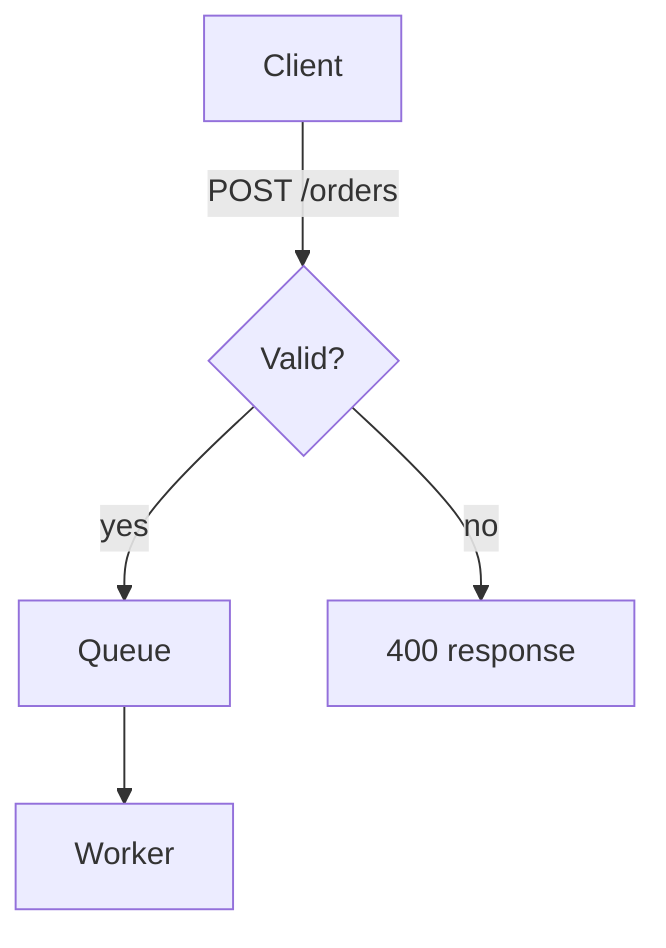

Shapes (`id` is what edges use; the shape holds the label):

| Syntax | Shape |
|---|---|
| `A[Text]` | rectangle |
| `A(Text)` | rounded |
| `A([Text])` | stadium / pill |
| `A[[Text]]` | subroutine |
| `A[(Text)]` | database / cylinder |
| `A((Text))` | circle |
| `A(((Text)))` | double circle |
| `A{Text}` | rhombus / decision |
| `A{{Text}}` | hexagon |
| `A[/Text/]` | parallelogram |
| `A[\Text\]` | parallelogram (alt) |
| `A[/Text\]` | trapezoid |
| `A[\Text/]` | trapezoid (alt) |
| `A>Text]` | asymmetric |

Edges: `-->` arrow, `---` open link, `-.->` dotted, `==>` thick, `~~~` invisible,
`--o` / `--x` circle and cross ends, `<-->` bidirectional.
Chain and fan out: `A --> B --> C`, `A --> B & C`.

Grouping, with a declared direction inside the group:

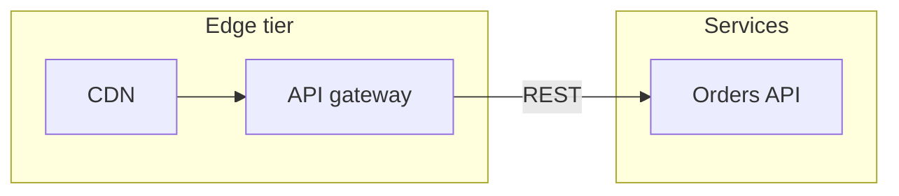

Styling — semantic classes, no theme directives:

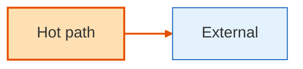

## sequenceDiagram

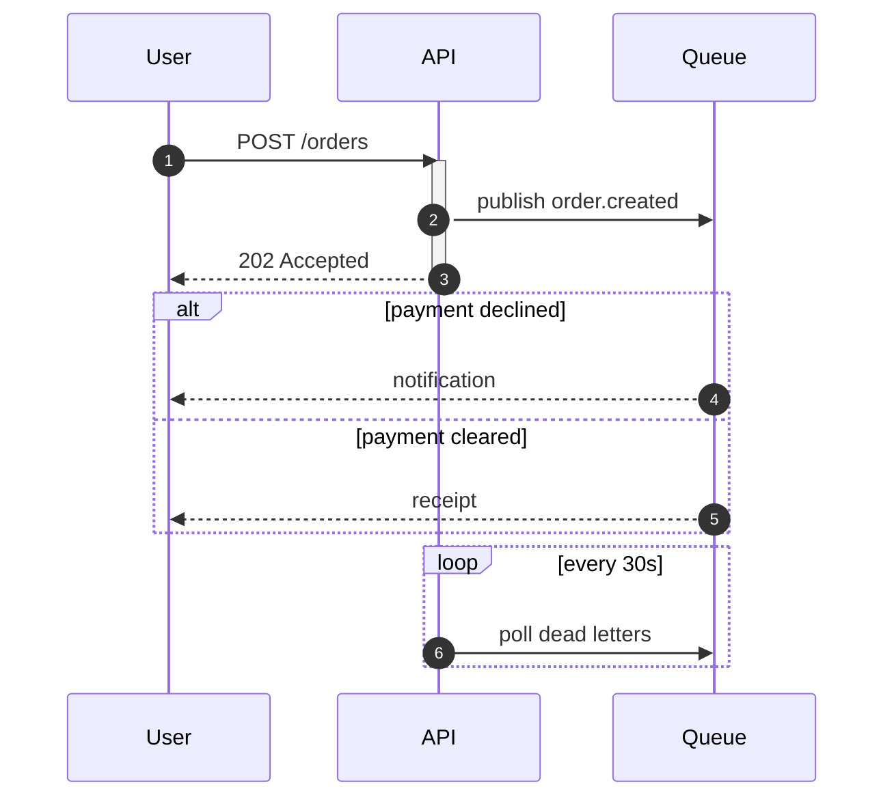

Arrows: `->>` solid with head, `-->>` dashed reply, `-)` open (fire and forget),
`-x` cross. `Note over A,B: text`, `Note right of A: text`. `break` and `par` also exist.

Phase bands inside a sequence diagram (the sequence-flavoured equivalent of a subgraph):

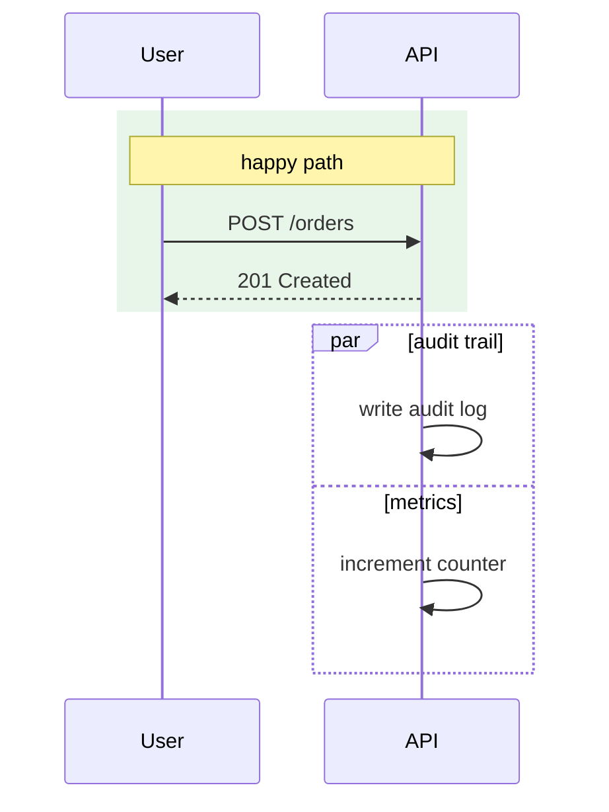

`actor U as User` draws a stick figure instead of a box. `box … end` (documented upstream)
throws `Option is not defined` in mermaid 12.1.0 — use `rect` bands instead.

## stateDiagram-v2

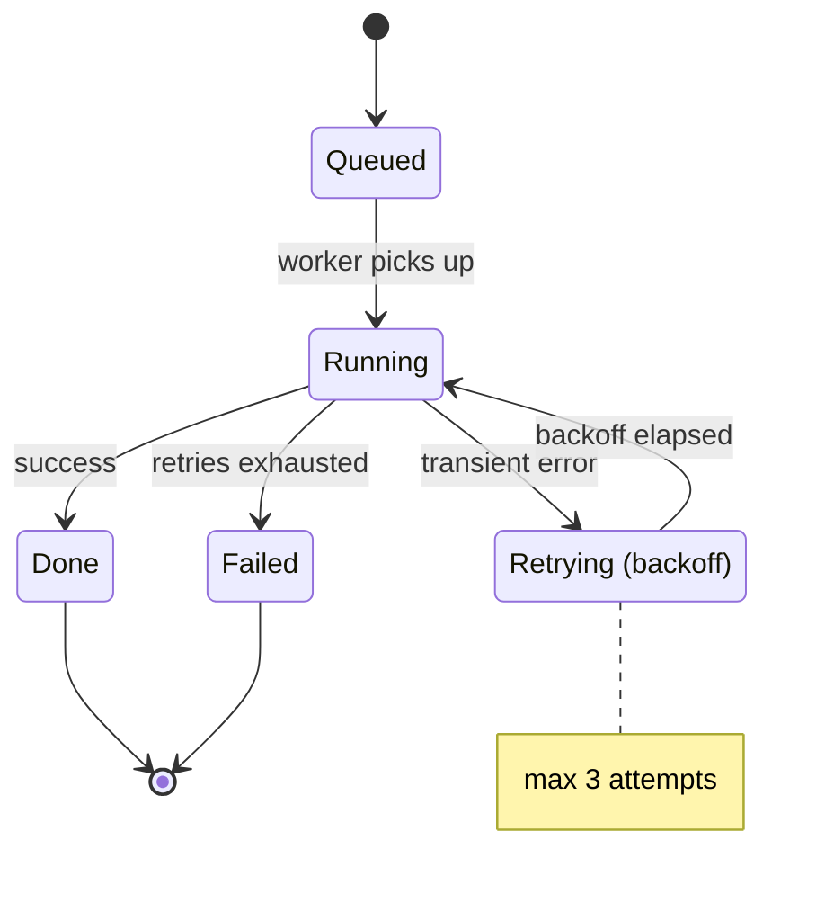

Names with spaces need `state "In Progress" as IP` — unquoted `[*] --> In Progress`
silently creates two states. Composite and pseudo-states:

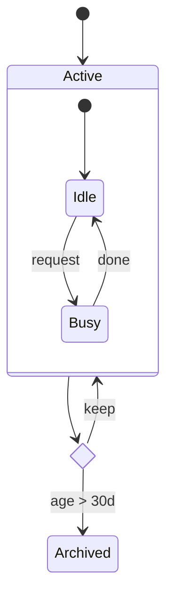

`<<fork>>` / `<<join>>` also exist. Multi-line notes use an explicit terminator:

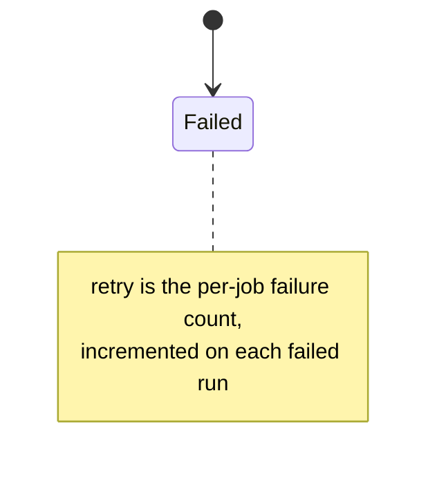

`stateDiagram-v2` accepts `classDef` / `class` exactly like a flowchart.

## classDiagram

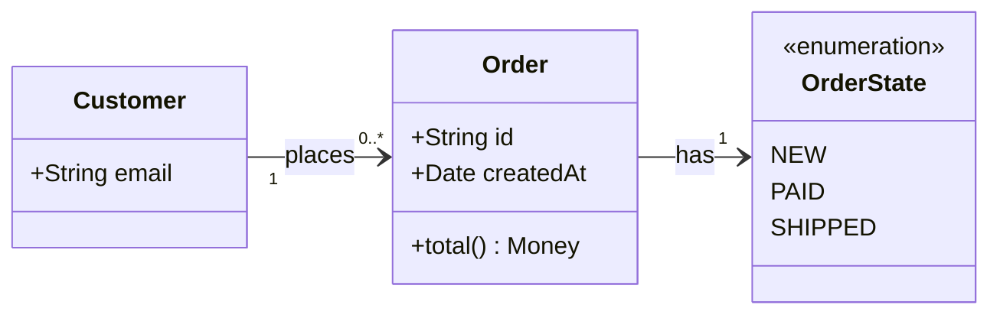

Relations: `<|--` inheritance, `*--` composition, `o--` aggregation, `-->` association,
`..>` dependency, `..|>` realization. Generics: `class Box~T~`. Interfaces: `<<interface>>`.

## erDiagram

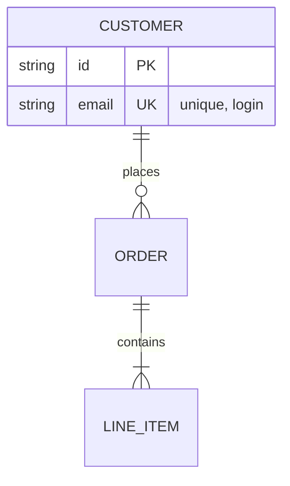

Cardinality: `||` exactly one, `o|` zero or one, `}|` one or more, `o{` zero or more.
Entity names with hyphens need quotes: `"ORDER-ITEM"`.

## mindmap, timeline, pie

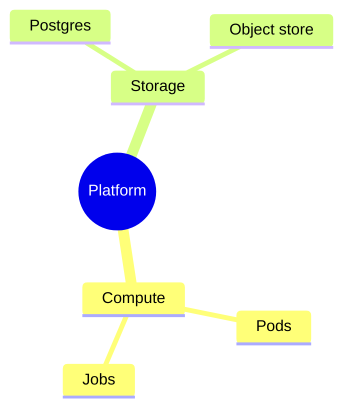

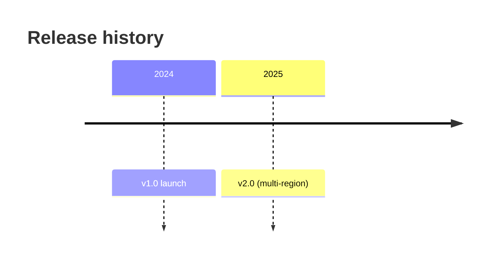

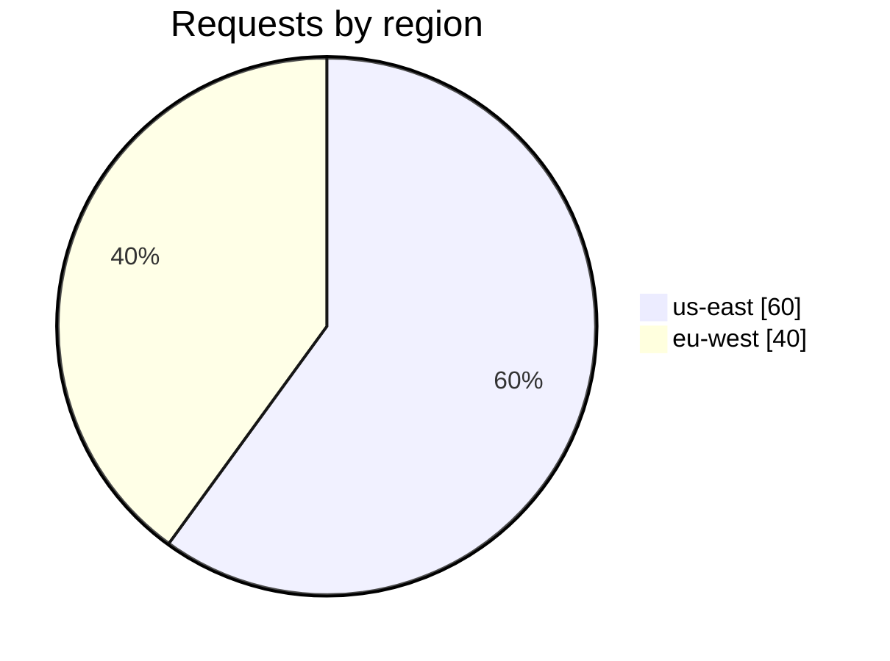

`pie` requires quoted labels — unquoted values are a parse error.

## gantt

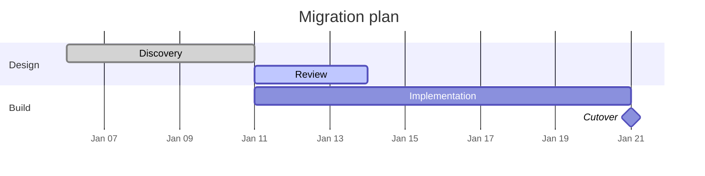

## quadrantChart, xychart, gitGraph

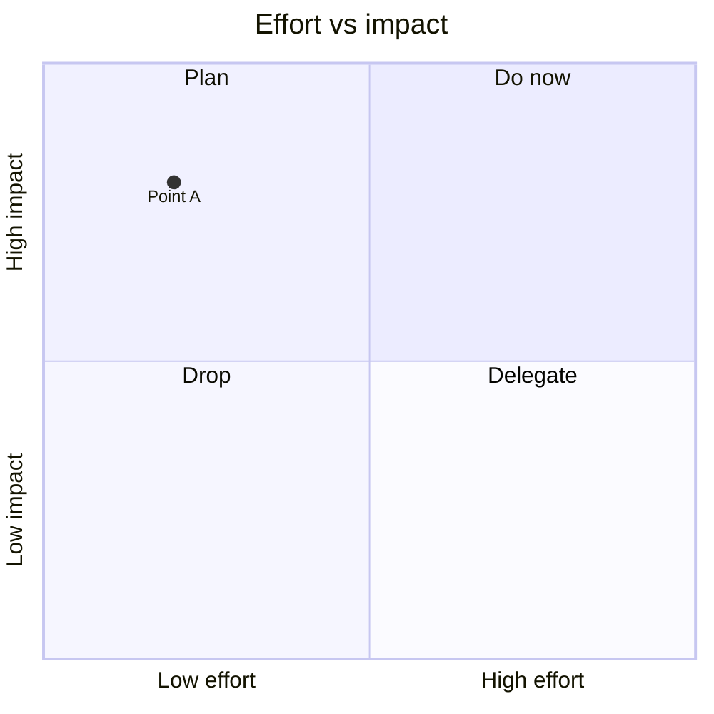

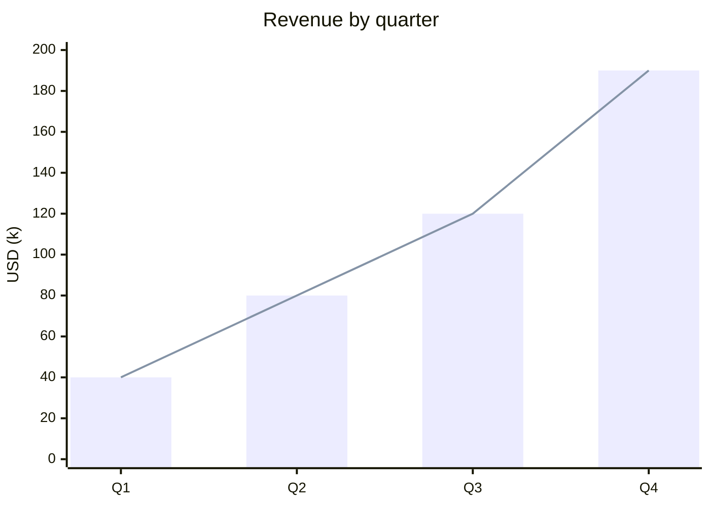

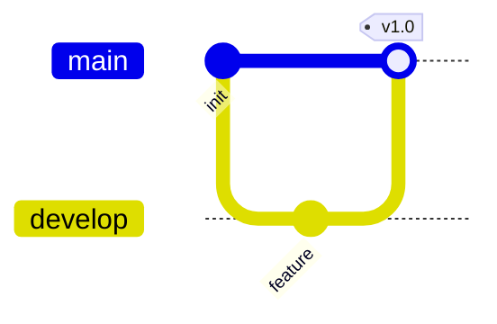

## C4, block, architecture

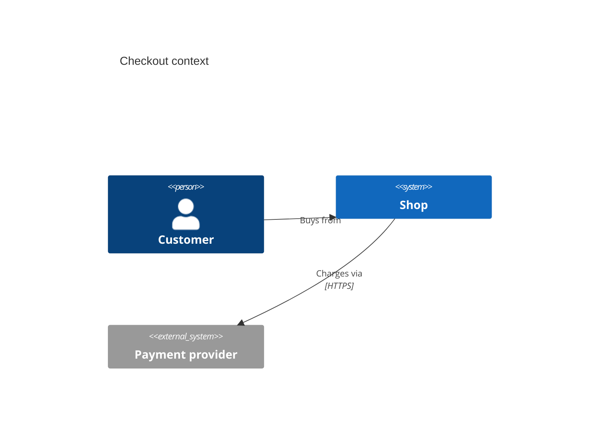

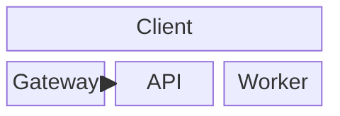

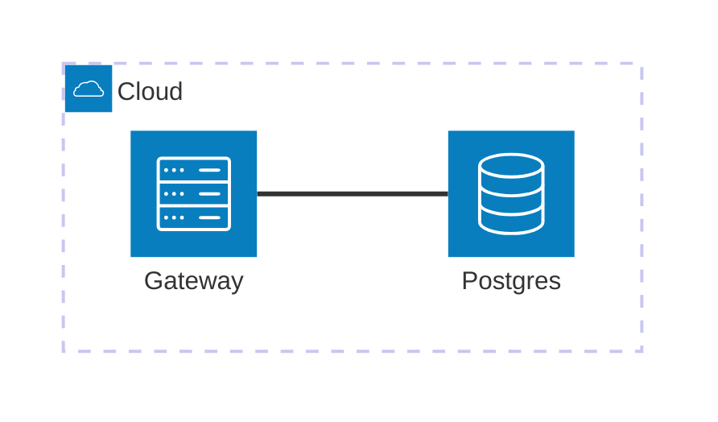

## Configuration

Prefer diagram-level styling (`classDef`, `style`, `linkStyle`) — it survives every renderer.
For global config, frontmatter beats the deprecated directive:

```mermaid
---
config:
  theme: base
  themeVariables:
    fontFamily: Inter
    primaryColor: "#e8f0fe"
  flowchart:
    curve: basis
    nodeSpacing: 40
---
flowchart LR
  A --> B
```

`%%{init: {"theme":"dark"}}%%` still parses (and malformed JSON inside it is silently
ignored — no error, no effect), but it is deprecated since mermaid v10.5 and hosted
renderers may strip it.

## Text, line breaks, escaping

- Line break inside a label: `A["line one<br/>line two"]`
- Inner double quotes: `A["say #quot;hi#quot;"]`
- Commas, semicolons, `#`, `%`, `<`, `>` are **safe unquoted** inside `[...]` (measured)
- ASCII `(` `)` are **not** safe unquoted — quote them
- Full-width punctuation (Chinese `（）`, `：`) is safe unquoted
- Markdown strings: `` A["`code`"] ``
