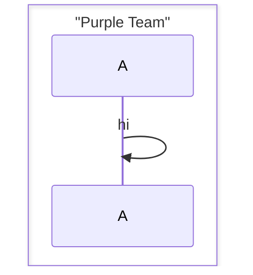
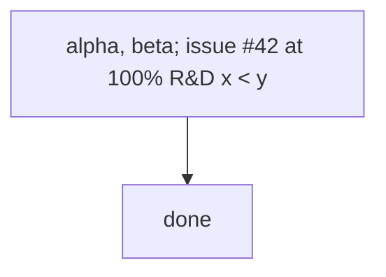
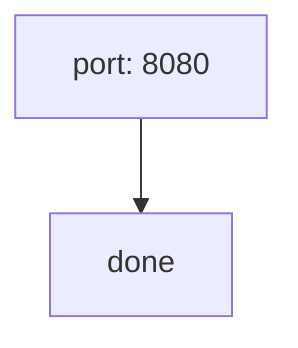
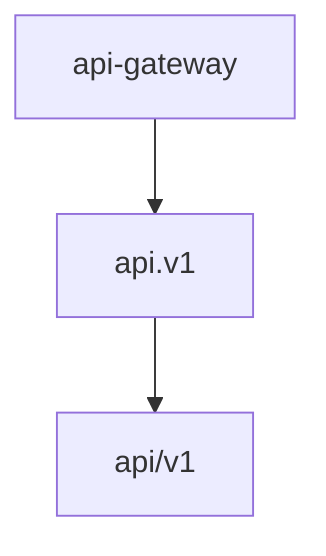
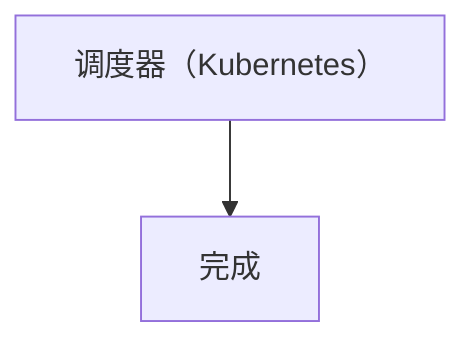
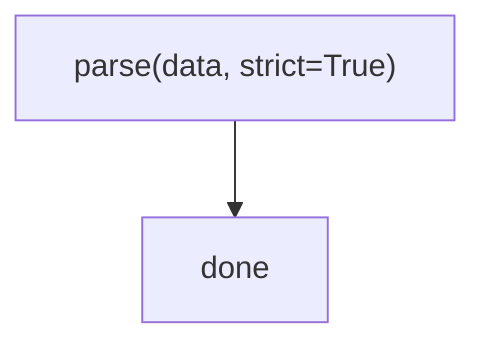
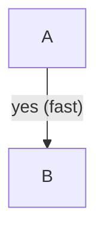

# Gotcha probe corpus

Every claim in `gotchas.md` comes from this file. Run it to re-measure after a mermaid
version bump:

```bash
node scripts/check-mermaid.mjs reference/gotchas-cases.md
```

**Exit code 1 and a list of FAILs is the expected result** — half of these snippets are
deliberately broken. Compare the FAIL names against the EXPECT comments below and against
the tables in `gotchas.md`; a snippet that changes verdict means the grammar moved.

## Parse failures (each EXPECT: FAIL)

Node label with bare ASCII parens — EXPECT FAIL:

```mermaid
flowchart TD
  A[parse(data)] --> B[done]
```

Edge label with bare parens — EXPECT FAIL:

```mermaid
flowchart TD
  A -->|yes (fast)| B
```

Flowchart edge with a colon label — EXPECT FAIL:

```mermaid
flowchart TD
  A --> B: hello
```

Unquoted pipe inside an edge label — EXPECT FAIL:

```mermaid
flowchart TD
  A -->|a|b| C
```

`end` as a bare node id — EXPECT FAIL:

```mermaid
flowchart TD
  end --> B[done]
```

Nested raw double quotes — EXPECT FAIL:

```mermaid
flowchart TD
  A["say "hi" now"] --> B
```

Unbalanced quote — EXPECT FAIL:

```mermaid
flowchart TD
  A["foo] --> B
```

Extra closing bracket — EXPECT FAIL:

```mermaid
flowchart TD
  A[foo]] --> B
```

`subgraph` without `end` — EXPECT FAIL:

```mermaid
flowchart TD
  subgraph Backend
    A --> B
```

Two diagrams in one fence — EXPECT FAIL:

```mermaid
flowchart TD
  A --> B
flowchart LR
  C --> D
```

Class body never closed — EXPECT FAIL:

```mermaid
classDiagram
  class A {
    +foo() void
```

`pie` with unquoted labels — EXPECT FAIL:


Internal type name used as a keyword — EXPECT FAIL:

```mermaid
flowchart-v2 TD
  A --> B
```

Sequence `box` (upstream mermaid 12.1.0 bug: `ReferenceError: Option is not defined`)
— EXPECT FAIL:



## Safe unquoted (each EXPECT: OK)

Commas, semicolons, `#`, `%`, `&`, `<` in a node label:



Colon in a node label (only flowchart *edges* reject the colon):



Hyphen, dot and slash in bare node ids:



Full-width punctuation, unquoted (Chinese `（）` and `：`):



Quoted label containing parens:



Quoted edge label containing parens:



Sequence message with parens, `&` and punctuation, unquoted:

```mermaid
sequenceDiagram
  A->>B: GET /users?page=1&size=20 (cached)
```

State description containing parens (`CLOSED: no connection (no TCB)`):

```mermaid
stateDiagram-v2
  [*] --> CLOSED
  CLOSED: no connection (no TCB)
```

Class member with parenthesised, comma-separated parameters:

```mermaid
classDiagram
  class L {
    +issueLoan(book, member) Loan
  }
```

Tab indentation instead of spaces (CRLF endings were measured as OK too):

```mermaid
flowchart TD
	A --> B
```

```

## Silent traps (EXPECT: OK here — the damage is at render time)

`[*] --> In Progress` parses but creates two states, `In` and `Progress` — EXPECT OK
(and wrong):

```mermaid
stateDiagram-v2
  [*] --> In Progress
```

A node named on an edge line inside a `subgraph` joins that group even when it was defined
outside — here `F` ends up in `Prod`, so the edge belongs after the `end` — EXPECT OK
(and wrong):

```mermaid
flowchart TD
  E --> F
  subgraph Prod
    F --> G
  end
```

Double dash inside what looks like an id parses as an edge (`api` → `gateway`) — EXPECT OK
(and wrong):

```mermaid
flowchart TD
  api--gateway --> db
```

Malformed JSON inside an init directive is silently ignored — EXPECT OK (and inert):

```mermaid
%%{init: {"theme": base}}%%
flowchart TD
  A --> B
```
