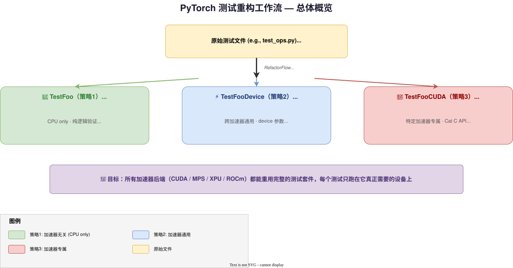
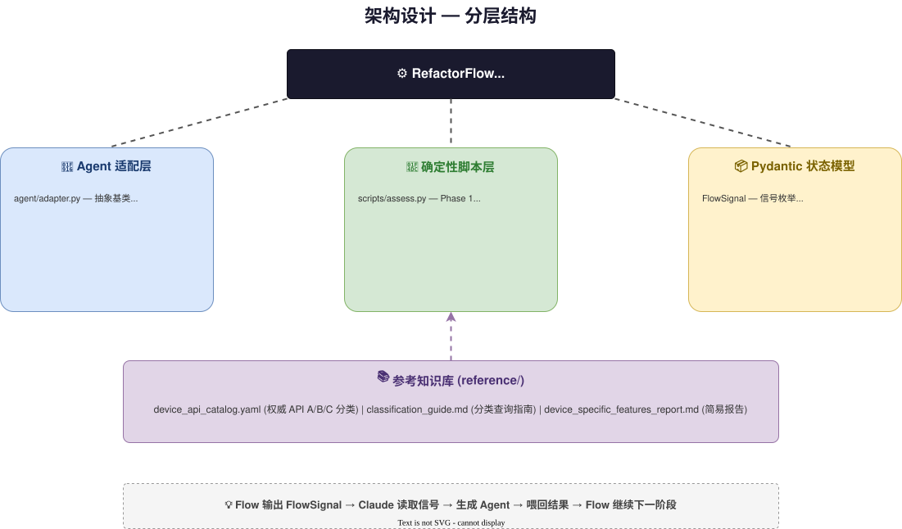
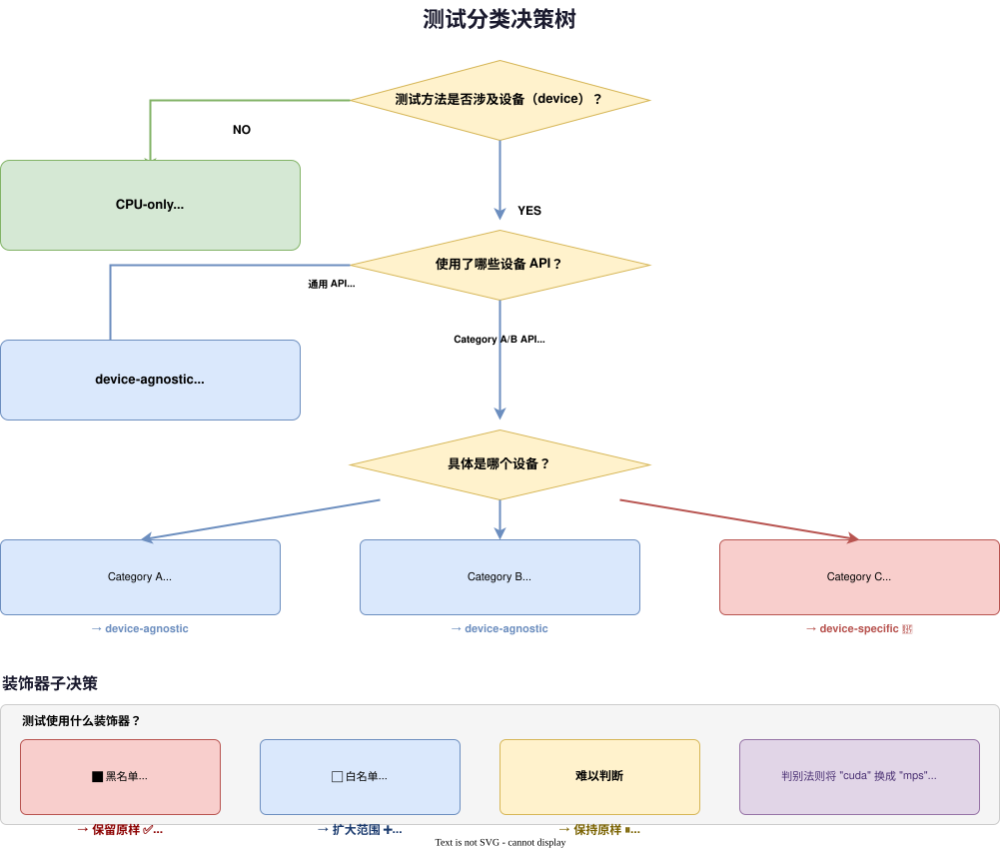
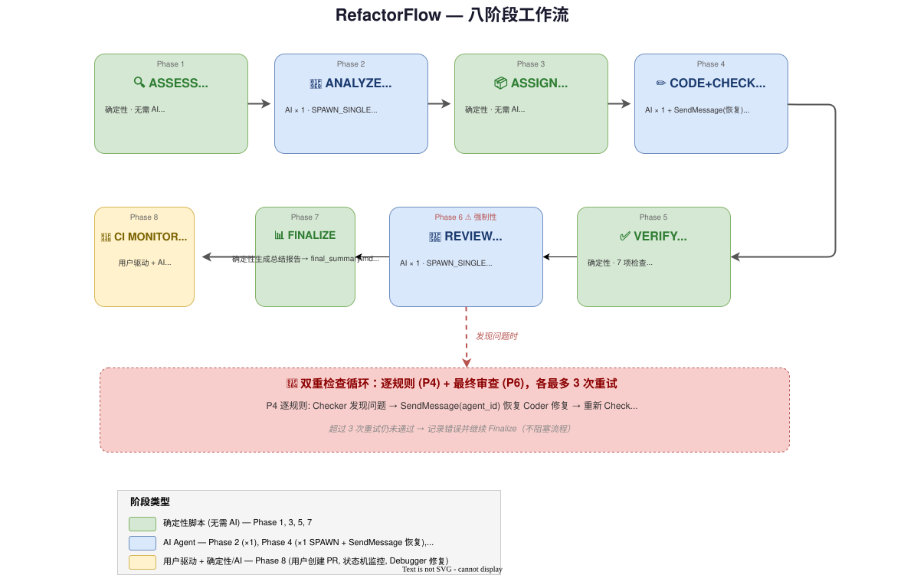
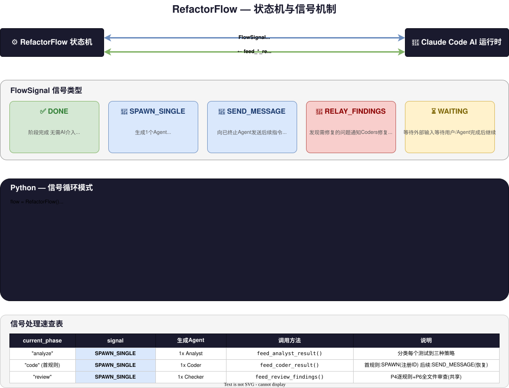

# 🔧 PyTorch 测试重构工作流

> 将 PyTorch 测试文件从特定硬件加速器解耦，实现跨加速器（CUDA / MPS / XPU）测试复用。

---

## 📖 目录

- [概述](#概述)
- [架构设计](#架构设计)
- [核心概念：三大策略](#核心概念三大策略)
- [七阶段工作流](#七阶段工作流)
- [状态机与信号机制](#状态机与信号机制)
- [关键规则](#关键规则)
- [使用方式](#使用方式)
- [工作空间](#工作空间)
- [项目结构](#项目结构)

---

## 概述

**TL;DR**：`pytorch-test-refactoring` 是一个 AI 驱动的 7 阶段状态机工作流，将 PyTorch 测试文件按三种策略拆分为设备无关/设备通用/设备专属类。Flow 发出 `SPAWN_SINGLE`、`RELAY_FINDINGS` 信号由 Claude Code 生成 Agent 执行，中间穿插确定性脚本进行文件评估、7 项自动化验证和总结报告生成。核心原则：黑名单跳过必须保留（有意的已知缺陷）、白名单限制必须扩大（历史遗留的人为限制）、Category A/B API 不是设备专属（Category C 才是）。

本工作流是一个 **AI 驱动的 7 阶段状态机**，用于将 PyTorch 测试文件按设备依赖度拆分为三类：

> 


**工作流由 `RefactorFlow` 状态机驱动**，通过 `orchestrator.py` 作为 CLI 桥接层输出 JSON 任务规格，Claude Code 作为 AI 运行时——Flow 返回 `FlowSignal` 信号来指示何时需要生成 AI Agent 或向已有 Agent 发送后续指令。Agent ID 在首次生成时注册并被持久化，后续指令通过 `SendMessage(agent_id)` 自动恢复已终止的 Agent（保留完整上下文）。

---

## 架构设计

> 

```
orchestrator.py (CLI 桥接层 → JSON 任务规格 ↔ Agent / SendMessage 工具调用)
    │
RefactorFlow (状态机核心)
    │
    ├── Agent 适配层 (agent/)  → AI Prompts: analyst / coder / checker
    ├── 确定性脚本层 (scripts/) → assess / verify / report / logger
    └── Pydantic 状态模型 (state.py)
              │
              └── 参考知识库 (reference/)
                  device_api_catalog.yaml / classification_guide.md
```

### 各层角色

| 层             | 文件         | 职责                                                                   |
| -------------- | ------------ | ---------------------------------------------------------------------- |
| **状态模型**   | `state.py`   | Pydantic 模型定义（`FlowSignal`、`AnalystReport`、`RefactorState` 等） |
| **CLI 桥接**   | `orchestrator.py` | 将 Flow 信号转换为 JSON 任务规格，Agent ID 注册与持久化，结果路由          |
| **状态机**     | `flow.py`    | 7 阶段编排，信号生成，进度恢复，Agent ID 生命周期管理                    |
| **Agent 适配** | `agent/`     | 为每个阶段生成 Agent 任务，包含专业 Prompt                             |
| **确定性脚本** | `scripts/`   | 无需 AI 的阶段：评估、验证、报告生成                                   |
| **参考知识**   | `reference/` | API 分类目录、分类指南、设备特性报告                                   |
| **工具函数**   | `utils.py`   | 路径常量、工作空间、git 工具                                           |

---

## 核心概念：三大策略

每个测试方法根据其设备依赖关系，归入三种策略之一：

> 


### 策略对比

| 策略      | 类命名            | 实例化机制                                      | 示例                                                                    | 使用场景                             |
| --------- | ----------------- | ----------------------------------------------- | ----------------------------------------------------------------------- | ------------------------------------ |
| **策略1** | `TestFoo`（原名） | `@instantiate_parametrized_tests` 或 `TestCase` | `TestBinaryUfuncs`                                                      | 无设备依赖的纯逻辑测试               |
| **策略2** | `TestFooDevice`   | `instantiate_device_type_tests()`               | `TestBinaryUfuncsDevice` → 生成 `TestBinaryUfuncsDeviceCPU/CUDA/MPS` 等 | 使用 device 参数但仅需通用加速器 API |
| **策略3** | `TestFoo<Device>` | `@instantiate_parametrized_tests` 或 `TestCase` | `TestBinaryUfuncsCUDA`                                                  | 需要特定加速器的独特功能             |

### 设备 API 分类层次

```
Category C（设备专属） > Category B（通用概念） > Category A（有 accelerator 等价物） > 无设备使用
```

**首次匹配即停止。** 测试中使用了任何 Category C API → 策略3。

| 分类           | 含义                              | 示例 API                                                      | 策略  |
| -------------- | --------------------------------- | ------------------------------------------------------------- | ----- |
| **Category A** | 存在 `torch.accelerator.*` 等价物 | `empty_cache`、`synchronize`、`CUDAGraph`→`Graph`、`memory_*` | 策略2 |
| **Category B** | 跨后端通用概念，暂无 wrapper      | `Stream`、`Event`、`manual_seed`、`get_device_properties`     | 策略2 |
| **Category C** | 真正设备专属，无跨设备等价物      | NCCL、NVTX、cuDNN、GDS、Jiterator、Metal shader               | 策略3 |

---

## 七阶段工作流

> 


### 各阶段详解

#### 🔍 Phase 1：Assess（评估）

**类型**：确定性脚本，无需 AI

**做什么**：
- 计算文件总行数、测试方法数量、类名列表
- 计算文件总行数、测试方法数量、类名列表
- 分析类布局和行范围（供分析师参考）
- Coder 数量由后续 Phase 3 根据适用的重构规则动态决定
- 输出：`assessment.json`

#### 🧠 Phase 2：Analyze（分析）

**类型**：AI Agent（单个）— 信号 `SPAWN_SINGLE`

**做什么**：
1. 审核所有 `@onlyCUDA` 的使用——是否为真正的 Category C（设备专属）
2. 审核所有 `@skipXPU` / `@skipCUDAIf` / `@skipMPS` / `@skipMeta` / `@onlyNativeDeviceTypesAnd`——黑名单跳过必须保留
3. 找出失效导入——`TEST_CUDA`、`TEST_MPS`、`TEST_XPU` 等不再需要的
4. **将每个测试分类到三种策略**
5. 验证测试数量——所有原始测试必须被覆盖

**输出**：`analyst_report.md` + `analyst_report.json`

#### 📦 Phase 3：Assign（派发）

**类型**：确定性脚本，无需 AI

**职责**：**派发（Assigning）**——将分析师的分策略转换为 coder 子任务，分发阶段负责按规则创建任务。

**做什么**：
- 根据分析师报告中的策略决定适用的重构规则
- 每条规则创建一个 coder 任务——单一coder 逐个执行，每个规则完成后由 checker 验证
- 将分析师 findings 按规则映射到对应 coder
- 输出：`coder_tasks.json`

#### ✏️ Phase 4：Code + Check（编码 + 逐规则检查）

**类型**：AI Agent（单个 coder，通过消息驱动）— 信号 `SPAWN_SINGLE` + `SEND_MESSAGE`

**循环**：一个 coder agent 逐规则执行，agent_id 持久化用于跨消息恢复：

```
SPAWN coder（规则 1，注册 agent_id）→ checker → pass
SEND_MESSAGE(agent_id) "规则 2" → checker → pass
SEND_MESSAGE(agent_id) "规则 3" → checker → fail
SEND_MESSAGE(agent_id) "修复规则 3" → checker → pass
→ 全部完成
```

**做什么**：
- 第一条规则：生成 coder agent（名称为 "coder"），**捕获并持久化 agent_id**
- 后续规则：通过 `SendMessage(to=agent_id)` 自动恢复已终止的 agent，保留完整对话历史
- Checker 在每条规则后验证；同一 checker 处理逐规则和最终审查

**输出**：每次响应的 `CoderResult`

#### ✅ Phase 5：Verify（验证）

**类型**：确定性脚本，7 项检查

| #   | 检查项                | 说明                                                                       |
| --- | --------------------- | -------------------------------------------------------------------------- |
| 1   | **语法检查**          | `py_compile.compile()`                                                     |
| 2   | **测试计数**          | `def test_` 数量必须与原始一致                                             |
| 3   | **类结构**            | 原始类的测试必须被覆盖（可以是子类）                                       |
| 4   | **DecorateInfo 对齐** | 类重命名后 `common_methods_invocations.py` 中的引用必须更新                |
| 5   | **外部引用**          | 类重命名后 `dynamo_skips/` 和 `dynamo_expected_failures/` 中的条目必须更新 |
| 6   | **残留模式**          | 不应有 `.cuda()`、`device="cuda"`、`onlyOn(` 等新旧模式残留                |
| 7   | **导入审计**          | 不应有 `TEST_CUDA`、`TEST_MPS`、`TEST_XPU` 等失效导入                      |

**输出**：`verification.json`

#### 🔎 Phase 6：Final Review（最终审查）

**类型**：AI Agent（单个）— 信号 `SPAWN_SINGLE`

> ⚠️ **此阶段为强制性**——即使每条规则的检查都通过，也必须运行最终的全文件审查。Checker 会在全文件范围内检查分类正确性、命名规范违规和遗漏的重构机会。

**做什么**：
- 阅读团队状态和审计日志
- 对所有 coder 的工作进行全文件质量审查
- 9 大审查重点（黑名单跳过保留、白名单扩大、分类正确性、命名规范等）
- 如果发现问题 → `RELAY_FINDINGS` 信号 → 通过 `SendMessage(coder_agent_id)` 通知对应 coder 修复 → 重新验证（最多重试 3 次）

> **与 Phase 4 的 checker 角色相同**——Phase 4 的逐规则检查和本阶段的最终审查使用同一个 checker agent，共享完整的参考上下文。

**输出**：`review_findings.json`

#### 📊 Phase 7：Finalize（最终化）

**类型**：确定性脚本，无需 AI

**做什么**：
- 生成最终的 Markdown 总结报告
- 汇总：类布局、验证结果、审查发现、策略分配
- 输出：`final_summary.md`

---

## 状态机与信号机制

> 

### 状态模型

```
RefactorState
├── 文件信息：file_path, file_name, file_size
├── 分片信息：coder_count, line_ranges[], class_layout[]
├── 阶段产物：analyst_report / coder_tasks / coder_results / verification / review_findings / final_summary
├── Agent 追踪：agent_ids{} (name → agent_id 映射，用于 SendMessage 恢复)
├── 控制状态：current_phase / retry_count (最多3次) / signal: FlowSignal
└── 工作空间: workspace: Path
```

### FlowSignal 信号

| 信号             | 含义                     | Claude 的动作                                                  |
| ---------------- | ------------------------ | -------------------------------------------------------------- |
| `SPAWN_SINGLE`   | 需要生成 1 个 Agent      | 生成 Analyst / Coder（首规则）/ Checker，等待结果，调用 `feed_*_result()` |
| `SEND_MESSAGE`   | 向已终止 agent 发送后续指令 | `SendMessage(to=agent_id)` 自动恢复 agent（保留完整上下文），coder 响应后调用 `feed_coder_result()` |
| `RELAY_FINDINGS` | 审查发现问题需要修复     | 将 findings 发送给 coder，修复后调用 `feed_fix_complete()` |
| `DONE`           | 阶段完成，继续下一步     | 重新调用 `flow.run()` 进入下一阶段                             |
| `WAITING`        | 等待外部输入             | 等待用户/Agent 完成                                            |

### 循环模式

```
flow = RefactorFlow()
state = flow.run("test/test_ops.py")

while state.signal.value != "done":
    if state.signal == SPAWN_SINGLE:
        agent_id, result = spawn_agent(...)       # 生成 1 个 agent，捕获 agent_id
        flow.feed_agent_spawned(name, agent_id)   # 注册 agent_id（用于后续恢复）
        if state.current_phase == "analyze":
            flow.feed_analyst_result(result)
        elif state.current_phase == "code":
            flow.feed_coder_result("coder", result)
        elif state.current_phase == "review":
            flow.feed_review_findings(result)
    elif state.signal == SEND_MESSAGE:
        result = SendMessage(to=agent_id, ...)    # 恢复已终止 agent
        flow.feed_coder_result("coder", result)
    elif state.signal == RELAY_FINDINGS:
        SendMessage(to=coder_agent_id, ...)       # 转发给 coder 修复
        flow.feed_fix_complete()

    state = flow.run(state.file_path)  # 重新进入，从断点继续
```

### 断点续跑

Flow 支持跨进程恢复——所有中间产物持久化到工作空间：

```python
flow = RefactorFlow()
state = flow.run("test/test_ops.py", resume=True)  # 从磁盘加载已有产物
```

---

## 关键规则

### ⬛ 黑名单 vs ⬜ 白名单：核心原则

```
装饰器类型              性质              处理方式
─────────────────────────────────────────────────────
@skipXPU               黑名单（有意跳过）   保留原样
@skipCUDAIf            黑名单（有意跳过）   保留原样
@skipMPS               黑名单（有意跳过）   保留原样
@skipMeta              黑名单（有意跳过）   保留原样
@onlyNativeDeviceTypesAnd  黑名单模式       保留原样
─────────────────────────────────────────────────────
@onlyCUDA              白名单（人为限制）   扩大为 @onlyAccelerator
@onlyOn(["cuda","xpu"]) 白名单（人为限制）   扩大为 @onlyAccelerator
@unittest.skipIf(      白名单（门控限制）   替换为 @onlyAccelerator
  not TEST_CUDA, ...)
```

> **黑名单跳过是有意且知情的**——有人明确决定"这在 XPU 上不行"，删掉会导致 CI 失败。
> **白名单限制通常是历史遗留**——当初写 `@onlyCUDA` 只因为 CUDA 是唯一可用的加速器。

### "CUDA 作为设备" vs "CUDA 作为功能"

**这是最常见的误分类，也是最高价值的重构目标：**

| 模式                                              | 含义                  | 处理                               |
| ------------------------------------------------- | --------------------- | ---------------------------------- |
| `@onlyCUDA` + 测试通用 op（softmax、add、matmul） | CUDA 只是作为设备使用 | → 策略2，扩大为 `@onlyAccelerator` |
| `.cuda()` / `.to("cuda")` + 测试通用行为          | CUDA 只是设备放置     | → 策略2，替换为 `.to(device)`      |
| `device="cuda"` + 通用逻辑                        | 硬编码设备字符串      | → 策略2，使用 `device` 参数        |
| `TEST_CUDA` 作为"需要加速器"的门控                | 代理条件              | → 策略2，替换为 `@onlyAccelerator` |
| Category C API（NCCL、cuDNN 等）                  | 真正 CUDA 专属        | → 策略3，保留                      |

**判别法则**：将 `"cuda"` 替换为 `"mps"` 或 `"xpu"`，测试逻辑是否仍然合理？是 → 策略2，否 → 策略3。

### 常见陷阱速查

| 陷阱                                            | 后果                                 | 正确处理                                      |
| ----------------------------------------------- | ------------------------------------ | --------------------------------------------- |
| 删除黑名单跳过                                  | 在其他平台 CI 上崩溃                 | 保留 `@skipXPU`、`@skipCUDAIf` 等             |
| 将 Cat A API 视作 CUDA 专属                     | 测试被不必要锁定在 CUDA              | 替换为 `torch.accelerator.*` 等价物           |
| 将 Cat B API 视作 CUDA 专属                     | 同上                                 | 使用统一 `torch.Stream`/`Event` 或保留在策略2 |
| 将 `@onlyAccelerator` 用作类装饰器              | `instantiate_device_type_tests` 失败 | 只用作方法装饰器                              |
| `instantiate_device_type_tests` 用于纯 CPU 测试 | 创建无用的 CUDA/MPS 变体             | 使用 `@instantiate_parametrized_tests`        |
| 重命名类后未更新 DecorateInfo                   | 跳过/xfail 装饰器静默失效            | 搜索 `common_methods_invocations.py` 更新引用 |
| 策略1 类用设备后缀命名（如 `TestFooCPU`）       | 误导性命名，暗示不存在的依赖         | 用原名（如 `TestFoo`）                        |

---

## 使用方式

### 基本流程

```python
from pathlib import Path
import sys
skill_dir = str(Path(__file__).parent)
if skill_dir not in sys.path:
    sys.path.insert(0, skill_dir)
from flow import RefactorFlow

# 初始化
flow = RefactorFlow()

# 启动（Phase 1 自动运行，停在第 2 阶段等待 AI）
state = flow.run("test/test_ops.py")

# 此时的 Flow 停在需要 AI 的阶段
print(state.signal)         # FlowSignal.SPAWN_SINGLE
print(state.current_phase)  # "analyze"

# 查看待生成的 Agent 任务
tasks = flow.get_pending_tasks()
for t in tasks:
    print(f"  Agent: {t.agent_name} → {t.phase}")

# 循环处理直到完成
while state.signal.value != "done":
    if state.signal.value == "spawn_single":
        # 生成 1 个 Agent，捕获 agent_id
        agent_id, result = agent_output
        flow.feed_agent_spawned(task.agent_name, agent_id)
        flow.feed_analyst_result(result)  # 或 feed_coder_result / feed_review_findings

    elif state.signal.value == "send_message":
        # 向已有 agent 发送后续指令（agent_id 自动恢复）
        result = SendMessage(to=task.agent_id, ...)
        flow.feed_coder_result("coder", result)

    elif state.signal.value == "relay_findings":
        # 将审查发现转发给对应 coder 修复
        SendMessage(to=coder_agent_id, ...)
        flow.feed_fix_complete()

    state = flow.run(state.file_path)
```

### 信号处理速查

| `state.signal`   | `state.current_phase` | 应执行          | 应调用                   |
| ---------------- | --------------------- | --------------- | ------------------------ |
| `SPAWN_SINGLE`   | `"analyze"`           | 生成 Analyst    | `feed_analyst_result()`  |
| `SPAWN_SINGLE`   | `"code"` (首规则)     | 生成 Coder + 注册 agent_id | `feed_coder_result()`    |
| `SEND_MESSAGE`   | `"code"` (后续规则)   | SendMessage(agent_id) | `feed_coder_result()`    |
| `SEND_MESSAGE`   | `"code"` (修复)       | SendMessage(agent_id) | `feed_rule_fix_result()` |
| `SPAWN_SINGLE`   | `"review"`            | 生成 Checker    | `feed_review_findings()` |
| `RELAY_FINDINGS` | `"fix"`               | 通知 Coder 修复 | `feed_fix_complete()`    |
| `DONE`           | 任意                  | 无需            | 继续 `flow.run()`        |

---

## 工作空间

每次重构会在 `agent_space/refactor/{file_name}/` 下创建工作空间：

```
agent_space/refactor/test_ops/
├── assessment.json           # Phase 1：文件评估结果
├── analyst_report.md         # Phase 2：分析报告（可读）
├── analyst_report.json       # Phase 2：分析报告（结构化）
├── coder_tasks.json           # Phase 3：coder 任务分配（按重构规则）
├── verification.json         # Phase 5：7 项检查结果
├── review_findings.json      # Phase 6：审查发现
├── final_summary.md          # Phase 7：最终总结
├── audit.jsonl               # 审计日志（每行一个事件）
├── status.json               # 团队状态（实时可查询）
└── flow_state.json            # 状态机断点（phase, rule_index, agent_ids 等）
```

**`status.json`** 和 **`audit.jsonl`** 用于团队协调——Checker 和 Team Lead 读取这些文件来了解进度和干预。

---

## 项目结构

```
pytorch-test-refactoring/
├── README.md                    # 本文件
├── SKILL.md                     # Skill 入口定义
├── orchestrator.py              # CLI 桥接层（JSON 任务规格 ⇄ Agent/SendMessage）
├── flow.py                      # RefactorFlow 状态机（核心）
├── state.py                     # Pydantic 状态模型
├── utils.py                     # 常量和工具函数
├── scripts/
│   ├── assess.py                # Phase 1：文件评估（确定性）
│   ├── verify.py                # Phase 5：7 项自动化验证（确定性）
│   ├── report.py                # Phase 7：生成总结报告（确定性）
│   └── logger.py                # 审计日志和状态管理
├── agent/
│   ├── adapter.py               # Agent 任务构建抽象基类
│   ├── claude_code.py           # Claude Code 适配器
│   ├── prompts/
│   │   ├── analyst.md           # 分析师 Prompt
│   │   ├── coder.md             # 编码者 Prompt
│   │   └── checker.md           # 审查者 Prompt
│   └── skills/
│       ├── classify-test-files/ # 测试文件分类 skill
│       ├── refactor-test-decoupling/  # 解耦方法论 skill
│       └── review-test-refactoring/   # 重构审查 skill
├── .assets/diagrams/                             # 📊 draw.io 架构图表
│   ├── overview.svg                   #   概览：三大策略拆分
│   ├── architecture.svg               #   架构：分层组件设计
│   ├── workflow.svg                   #   流程：七阶段工作流
│   ├── decision-tree.svg              #   决策树：测试分类逻辑
│   └── signal-flow.svg                #   信号流：状态机与信号机制
└── reference/
    ├── device_api_catalog.yaml           # 权威 API 分类（A/B/C 类）
    ├── classification_guide.md           # API 分类查询指南
    └── device_specific_features_report.md # 设备专属特性详细报告
```

### 依赖关系

```
orchestrator.py → flow.py
flow.py
├── state.py          (数据模型，含 agent_ids)
├── utils.py          (工具函数)
├── scripts/assess.py (Phase 1)
├── scripts/verify.py (Phase 5)
├── scripts/report.py (Phase 7)
├── scripts/logger.py (日志)
└── agent/
    ├── adapter.py    (抽象基类，含 AgentTask.mode)
    └── claude_code.py (Claude Code 适配器)
```

---

## 🔗 相关 Skills

| Skill                      | 用途                                         |
| -------------------------- | -------------------------------------------- |
| `classify-test-files`      | 分类扫描——判断测试文件的设备依赖现状         |
| `refactor-test-decoupling` | 解耦方法论——完整的三大策略及常见模式处理     |
| `review-test-refactoring`  | 重构审查——对重构结果的正确性和完整性进行检查 |
