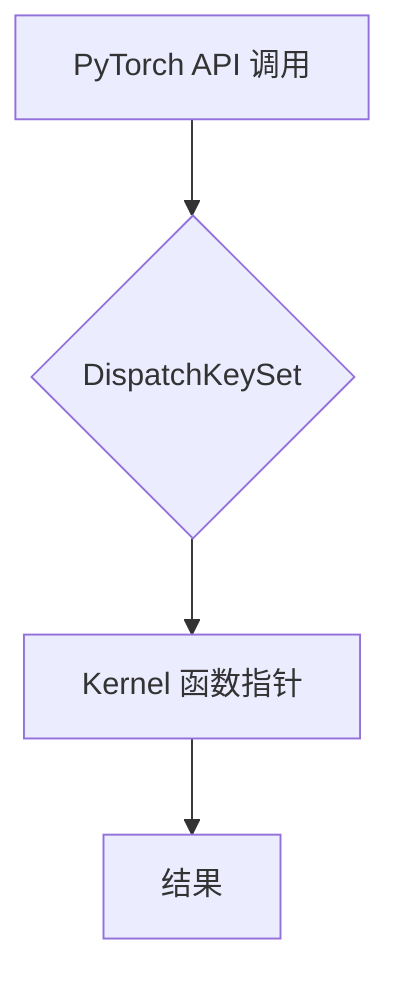
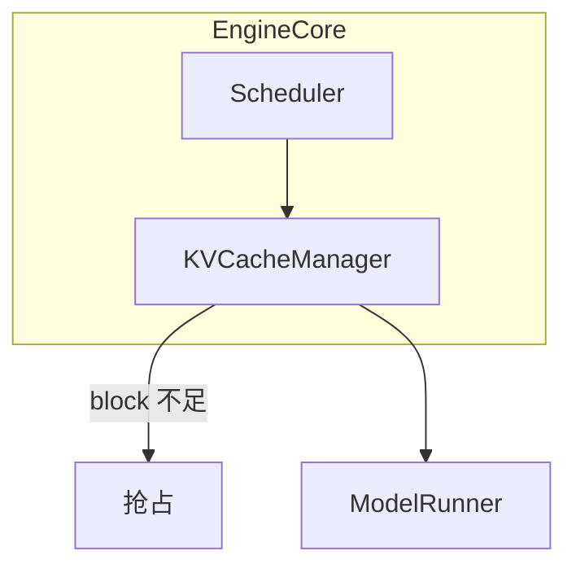
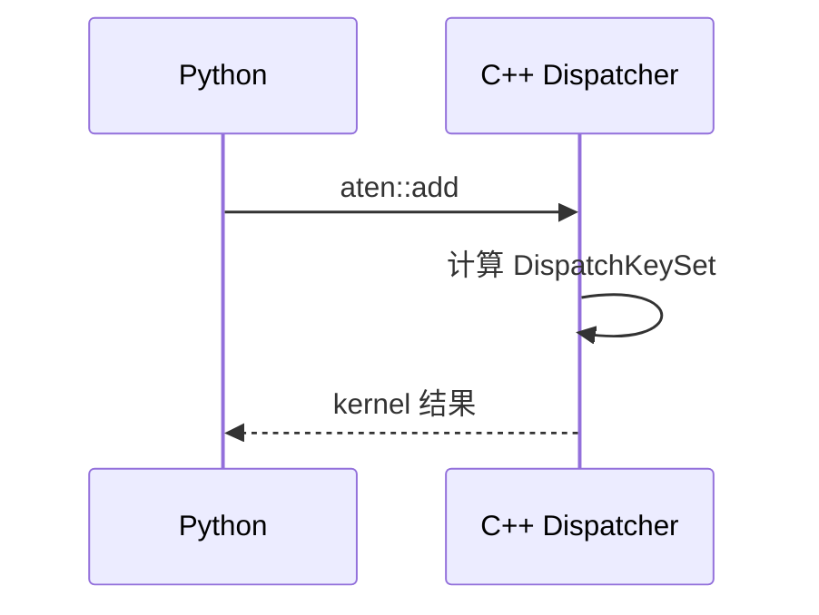
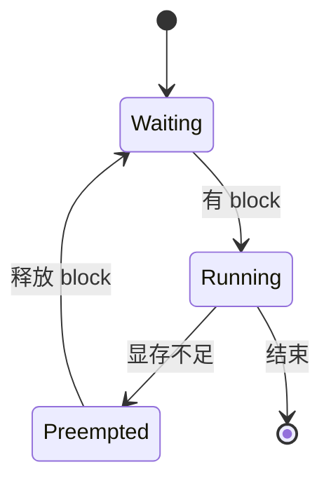
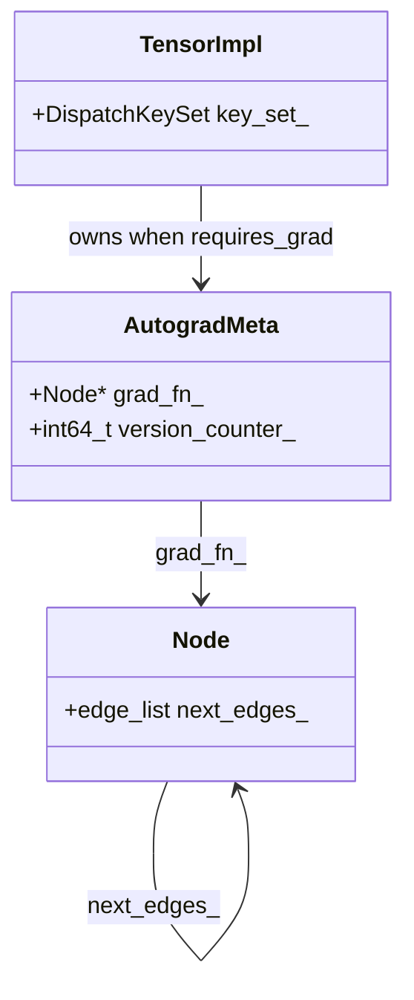
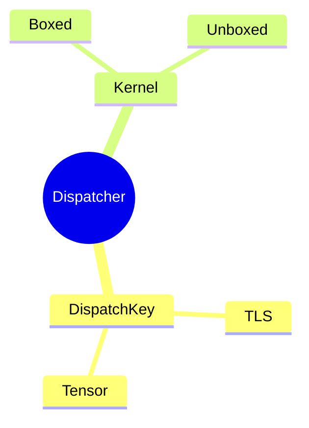

# Verified mermaid templates

Every snippet below was parse-checked against mermaid 12. Adapt them rather than
inventing structure. Validate anything you change with the mermaid-diagrams skill:

```bash
node <mermaid-diagrams-base>/scripts/check-mermaid.mjs <file-with-the-diagram>
```

## Measured syntax facts

| Input | Parses? |
|---|---|
| `flowchart`: `A[torch.add(x, y)]` — **unquoted ASCII parens** | **no — parse error** |
| `flowchart`: `A["torch.add(x, y)"]` | yes |
| `flowchart`: `A[调度器]`, `A[DispatchKey（TLS）]` — bare Chinese / full-width | yes |
| `sequenceDiagram` message containing `(in O(1))` | yes |
| `stateDiagram-v2` transition label containing `allocate_slots()` | yes |
| `classDiagram` relation label containing `(if requires_grad)` | yes |
| `mindmap` leaf containing `(thread local)` | yes |

So the quoting rule is narrow: **unquoted ASCII `(` / `)` breaks `flowchart` node
labels**, and only those. Full-width `（）` is safe everywhere, which is why Chinese
labels rarely need quoting.

Two more traps, both measured in mermaid-diagrams:

- `end` is reserved and cannot be a node id (`end --> B` fails). `A["end"]` is fine.
- An edge written inside a `subgraph` pulls every node named on that line into the
  group, even one defined outside it.

## flowchart — control flow, where a decision is made



Edge labels and grouping:



## sequenceDiagram — ordering across components over time



## stateDiagram-v2 — lifecycle, states, preemption



## classDiagram — data structures and their relations

Use this instead of forcing a struct/ownership diagram into a flowchart:



## mindmap — landscape of a subsystem


